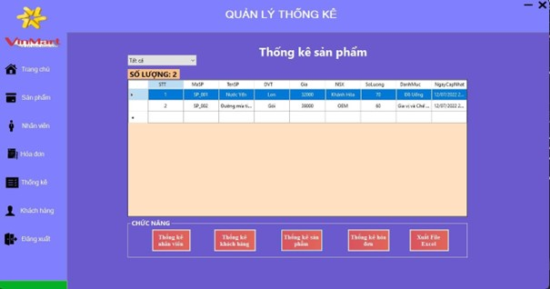

# Mô tả cơ sở dữ liệu
1.Bảng Cấp phát ID

| Tên    | Kiểu dữ liệu | Mô tả               |
|--------|--------------|---------------------|
| IDNV   | nvarchar(8)  | ID của nhân viên    |
| IDKH   | int          | ID của khách hàng   |
| IDHD   | nvarchar(8)  | ID của hóa đơn      |
| IDCTHD | nvarchar(8)  | ID của chi tiết hóa đơn |
| IDSP   | nvarchar(8)  | ID của sản phẩm     |
2. Bảng Chi tiết hóa đơn 

| Tên       | Kiểu dữ liệu | Mô tả           |
|-----------|--------------|-----------------|
| MaCTHD    | nvarchar(8)  | Mã chi tiết hóa đơn |
| MaHD      | nvarchar(8)  | Mã hóa đơn      |
| MaSP      | nvarchar(8)  | Mã sản phẩm     |
| TenSP     | nvarchar(8)  | Tên sản phẩm    |
| SoLuong   | Numeric(18,0)| Số lượng        |
| DonGia    | Decimal(18,0)| Đơn giá         |
| ThanhTien | Decimal(18,0)| Thành tiền      |

3. Bảng Khách hàng

| Tên         | Kiểu dữ liệu | Mô tả            |
|-------------|--------------|------------------|
| STT         | Int          | Số thứ tự       |
| MaNV        | nvarchar(8)  | Mã nhân viên    |
| Hoten       | nvarchar(25) | Họ và tên nhân viên |
| DiaChi      | nvarchar(80) | Địa chỉ nhân viên |
| NgaySinh    | Date         | Ngày sinh nhân viên |
| GioiTinh    | nvarchar(3)  | Giới tính       |
| SDT         | nvarchar(13) | Số điện thoại nhân viên |
| Email       | nvarchar(50) | Email           |
| Chucvu      | nvarchar(10) | Chức vụ         |
| NgayCapNhat | Datetime     | Ngày cập nhật   |

4. Bảng Nhân viên

| Tên         | Kiểu dữ liệu | Mô tả               |
|-------------|--------------|---------------------|
| STT         | Int          | Số thứ tự          |
| MaSP        | nvarchar(3)  | Mã Sản Phẩm        |
| TenSP       | nvarchar(30) | Tên sản phẩm       |
| DVT         | nvarchar(5)  | Đơn vị tính        |
| Gia         | Decimal(18,0)| Giá sản phẩm       |
| NSX         | nvarchar(50) | Nhà sản xuất       |
| SoLuong     | Int          | Số lượng           |
| DanhMuc     | nvarchar(30) | Danh mục           |
| NgayCapNhat | Datetime     | Ngày cập nhật      |

5. Bảng Sản phẩm

| Tên         | Kiểu dữ liệu | Mô tả            |
|-------------|--------------|------------------|
| STT         | Int          | Số thứ tự       |
| MaNV        | nvarchar(8)  | Mã nhân viên    |
| Username    | nvarchar(15) | Tên tài khoản   |
| Password    | nvarchar(35) | Mật khẩu        |
| IDPer       | Int          | ID phân quyền   |

6. Bảng Hoá đơn

   | Tên         | Kiểu dữ liệu | Mô tả              |
   |-------------|--------------|--------------------|
   | MaHD        | nvarchar(8)  | Mã hóa đơn         |
   | MaKH        | nchar(10)    | Mã khách hàng      |
   | MaNV        | nvarchar(8)  | Mã Nhân viên       |
   | TongTien    | Decimal(18,0)| Tổng tiền          |
   | NgayXuatHD  | date         | Ngày xuất hóa đơn |

# Demo sản phẩm
   # Giao diện Form Đăng nhập

      Hình 1. Giao diện Form Đăng nhập
-	Đăng nhập là một lối vào ứng dụng, trang web hoặc dịch vụ. Nó giúp người dùng thiết lập danh tính của họ.
-	Nếu thông tin tên tài khoản và mật khẩu đều đúng thì nó sẽ mở form Trang chủ, còn nếu mọi người nhập sai thì hệ thống sẽ báo lỗi nhập sai.

   # Giao diện Form Đăng ký

     Hình 2. Giao diện Form Đăng ký
     
-	Giao diện đăng ký thường đầy đủ thông tin cá nhân như số điện thoại, gmail, tên đăng nhập, ngày sinh,... để việc đăng nhập hay tra cứu thông tin một cách dễ dàng và phân biệt giữa nhiều tài khoản khác nhau.
-	Sau khi đăng ký tài khoản xong, bạn có thể đăng nhập tài khoản của bạn đã
     tạo qua phần mềm của chúng tôi đề trải nghiệm ứng dụng.

    # Giao diện Form Trang chủ

      Hình 3. Giao diện Form Trang chủ
      
-  Phía bên phải Form trang chủ gồm:
   +  Tên đăng nhập, quyền (chức vụ).
   + 	Mục chỉ tiêu từng tháng trong năm. - Thời gian, Lịch.

-  Ở phần trung tâm Form trang chủ:
   +	Tổng đơn hàng hằng ngày.
   +	Tổng Doanh Thu của ngày.
   +	Tổng số sản phẩm, số lượng bán được.
   +	Các quy định chung và các chức năng dành riêng cho Admin .

- Phía bên trái Form trang chủ có 8 chức năng cụ thể như sau:
   +	Trang chủ: là trang chính của phần mềm.
   +	Sản phẩm: là chức năng hiển thị thông tin sản phẩm và tạo thêm, sửa, xóa, hủy, làm mới và lưu thông tin sản phẩm vào bảng sản phẩm.
   +	Khách hàng: là chức năng hiển thị thông tin khách hàng và tạo thêm, sửa, xóa, hủy, làm mới và lưu thông tin sản phẩm vào bảng khách hàng.
   +	Nhân viên: là chức năng hiển thị thông tin sản phẩm và tạo thêm, sửa, xóa, hủy, làm mới và lưu thông tin sản phẩm bảng sản phẩm.
   +	Hóa đơn: là chức năng hiển thị thông tin sản phẩm và tạo thêm, sửa, xóa, hủy, làm mới và lưu thông tin sản phẩm bảng sản phẩm.
   +	Thống kê: là chức năng hiển thị thông tin sản phẩm và tạo thêm, sửa, xóa, hủy, làm mới và lưu thông tin sản phẩm bảng sản phẩm.
   +	Đăng xuất: là chức năng hiển thị thông tin sản phẩm và tạo thêm, sửa, xóa, hủy, làm mới và lưu thông tin sản phẩm bảng sản phẩm.

   # Giao diện Form Quản lý sản phẩm

      Hình 4. Giao diện Form Quản lý sản phẩm
      
- Quản lý sản phẩm có những chức năng sau:
   + Danh Mục từng sản phẩm.
   + Số thứ tự sản phẩm lá sắp xếp thứ tự các sản phẩm
   + Mã sản phẩm là mã để định danh giữa các sản phẩm. Các sản phẩm sẽ không được trùng mã với nhau, mã không chứa kí tự đặc biệt, không có dấu và khoảng cách.
   + Tên sản phẩm là trường thông tin bắt buộc và không bao gồm các giá trị thuộc tính như màu sắc, chất liệu, kích cỡ..
   + Giá
   + Đơn vị tính (hộp, lốc, thùng, lon, ...)
   + Số lượng là tổng số lượng có trong kho trong cửa hàng còn.
   + Chức năng gồm thêm, xóa, sửa, hủy, lưu, làm mới.
   + Danh sách sản phẩm là mục phân chia các hàng hóa, những hàng hóa có trong cửa hàng, sản phẩm đã được thêm vào sẽ được phân chia theo danh mục của chúng. - Tìm kiếm sản phẩm, theo tên, giá, mã sản phẩm,....
  
    # Giao diện Form Quản lý nhân viên

      Hình 5. Giao diện Form Quản lý nhân viên
      
- Quản lý nhân viên gồm những mục sau:
   + 	Thông tin nhân viên gồm có: Mã nhân viên, số điện thoại, họ tên nhân viên, ngày sinh nhân viên, giới tính, email, địa chỉ, chức vụ và bảng danh sách nhân viên.
   + 	Quản lý chức năng thông tin nhân viên:
      1.	Thêm thông tin nhân viên
      2.	Xóa một hàng trong bảng danh sách thông tin nhân viên
      3.	Hủy chức năng
      4.	Cập nhật lại các thông tin nhân viên mà mình muốn sửa lại.
      5.	Khởi tạo một thông tin nhân viên mới
      6.	Lưu thông tin vào danh sách nhân viên - Thanh tìm kiếm thông tin nhân viên.

   # Giao diện Form Quản lý khách hàng

       Hình 6. Giao diện Form Quản lý khách hàng
       
- Quản lý khách hàng gồm có mục như sau:
   + 	Thông tin khách hàng: Họ tên khách hàng, số điện thoại, giới tính, địa chỉ khách hàng và bảng danh sách khách hàng.
   + 	Quản lý chức năng thông tin khách hàng:
      1. Thêm thông tin khách hàng
      2. Xóa một hàng trong bảng danh sách thông tin khách hàng
      3. Hủy chức năng
      4. Cập nhật lại các thông tin khách hàng mà mình muốn sửa lại.
      5. Khởi tạo một thông tin mới
      6. Lưu thông tin vào danh sách khách hàng
      7. Thanh tìm kiếm và nút tra cứu thông tin khách hàng.

 # Giao diện Form Quản lý hoá đơn

   Hình 7. Giao diện Form Quản lý hoá đơn
   
- Quản lý Hóa Đơn gồm có mục như sau:
   + Thông tin hóa đơn: Mã hóa đơn, mã nhân viên, mã khách hàng, ngày xuất hóa đơn, Tổng tiền và bảng danh sách hóa đơn.
   + Quản lý chức năng thông tin hóa đơn:
      1. Thêm thông tin hóa đơn.
      2. Xóa một hàng trong bảng danh sách thông tin hóa đơn
      3. Hủy chức năng
      4. Cập nhật lại các thông tin hóa đơn mà mình muốn sửa lại.
      5. Khởi tạo một thông tin hóa đơn mới
      6. Lưu thông tin vào danh sách hóa đơn
      7. Thanh tìm kiếm và nút tra cứu thông tin hóa đơn.
      8. Nhấn nút xem CTHD để hiển thị giao diện form quản lý CTHD.

 # Giao diện Form Chi tiết hoá đơn

   Hình 8. Giao diện Form Chi tiết hoá đơn
   
- Quản lý chi tiết hóa đơn gồm các mục như sau:
   + Lưu lại các thông tin cần thiết trên giao diện form hóa đơn.
   + Thông tin chi tiết hóa đơn: Mã chi tiết hóa đơn, mã hóa đơn, mã sản phẩm, tên sản phẩm, số lượng, đơn giá, thành tiền và bảng danh sách chi tiết hóa đơn.
   + Quản lý chức năng thông tin khách hàng:
      1. Thêm thông tin sản phẩm vào bảng chi tiết hóa đơn.
      2. Xóa một hàng trong bảng danh sách thông tin chi tiết hóa đơn
      3. Hủy chức năng.
      4. Cập nhật lại các thông tin chi tiết hóa đơn mà mình muốn sửa lại. - Khởi tạo một thông tin chi tiết hóa đơn mới.
      5. Lưu thông tin mã hóa đơn, sản phẩm, số lượng, đơn giá, thành tiền vào danh sách chi tiết hóa đơn.

   # Giao diện Form Báo cáo, thống kê

   Hình 9. Giao diện Form Báo cáo, thống kê
   
-  Quản lý thống kê gồm các những chức năng như sau:
  + Thống kê nhân viên: là chức năng hiển thị các nhân viên.

   Hình 10. Giao diện Form thống kê nhân viên
   
-	Thống kê khách hàng: là chức năng hiển thị các khách hàng đã mua.

   Hình 11. Giao diện Form thống kê khách hàng
   
-	Thống kê sản phẩm: là chức năng hiển thị các chỉ tiêu hàng hóa từng ngày, từng tháng.

   Hình 12. Giao diện Form thống kê sản phẩm
   
-	Thống kê hóa đơn: là chức năng hiển thị các hóa đơn từng khách hàng đã mua các sản phẩm từ cửa hàng.

    Hình 13. Giao diện Form thống kê hoá đơn

    
-	Xuất file Excel: là chức năng sẽ xuất ra file Excel của từng chức năng thống kê như trên và đưa file thống kê vào thư điện tử của quản lý cửa hàng.

    Hình 14. Giao diện xuất file Excel thống kê
